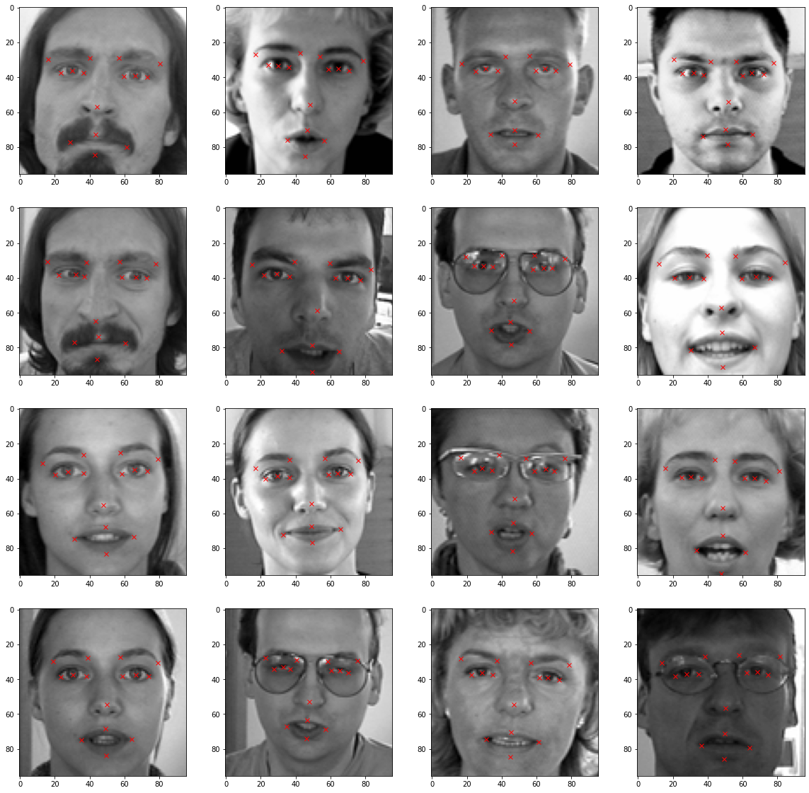
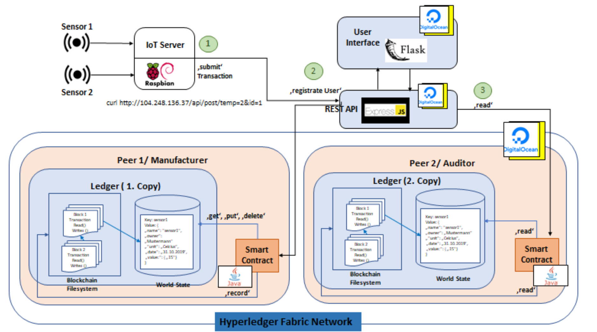
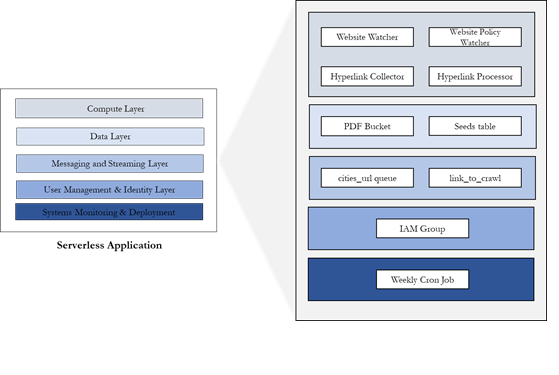

# Portfolio

## Computer Vision
---
### [Emoticon Generation with VAE](projects/vae)

 
In this project,  a VAE-based generative model is implemented that can produce new emojis, resembling those we are familiar with. Moreoever,a latent space interpolation & analysis is also done.
 

Reconstructed face with VAE

[Read more >>](projects/vae)

---

### [Emotion Recognition with Facial Landmark](projects/faciallandmark)

 
Facial expression can be considered as concrete evidence to identify human feelings. 
With the recent advancement in computer vision and deep learning, it is possible to detect emotions from facial images. Facial keypoint detection serves as a basis for Emotional AI application such as analysis of facial expression, detecting dysmorphic facial signs for medical diagnosis. Detecting facial keypoints is a very challenging problem since facial features can vary greately from one individual to another. The primary objective of this project is to predict keypoint positions on image by inspecting  different deep learning models based on Convolutional Neural Network. 
 

[Read more >>](projects/faciallandmark)

 
 
 

## Machine Learning

### Telco Customer Churn
[
 
[Read more >>](projects/telcochurn)

## Software Engineering
---
### [Blockchain](projects/blockchain)

Prototype of a full stack solution that generates humidity  data using sensors, which is persisted  in the Hyperledger Fabric blockchain framework and visualizes the blockchain data using Flask.
Read our project's report <a href="pdf/Final_Project_Report__HyperLedger.pdf">here</a>

[Read more >>](projects/blockchain)

 

  
---

### [Web Crawling](projects/webcrawling)
  

The use of the web crawler is inevitable when it comes to collecting massive data set. The use case for the web crawler implemented in this thesis is to extract information from an official announcement containing new building permissions. While running web crawler on a local machine is fine or do-once tasks, and a small amount of data, where the crawling process can be triggered manually. However, this is not a sustainable, and reliable solution  for retrieving a huge amount of data. Web crawler can be optimized with deploying into the cloud to reduce operational management and increase parallelism. Cloud computing also provides greater flexibility in term of computing capacity, and IP address.
Read my thesis <a href="pdf/BachelorThesis.pdf">here</a>

[Read more >>](projects/webcrawling)

 

 
 
 

---

## Natural Language Processing 
---
<!---
### [RASA Chatbot](projects/rasa)
  

Try the demo 

[Read more >>](projects/rasa)
-->
---

### [Twitter Sentiment Analysis with BERT on EU-Solidarity](projects/twitter)

[Read more >>](projects/twitter)

---
### [Sentence similarity based on semantic nets and corpus statistics](projects/sentsim)
<!----->

[Read more >>](projects/sentsim)
 
 
 
